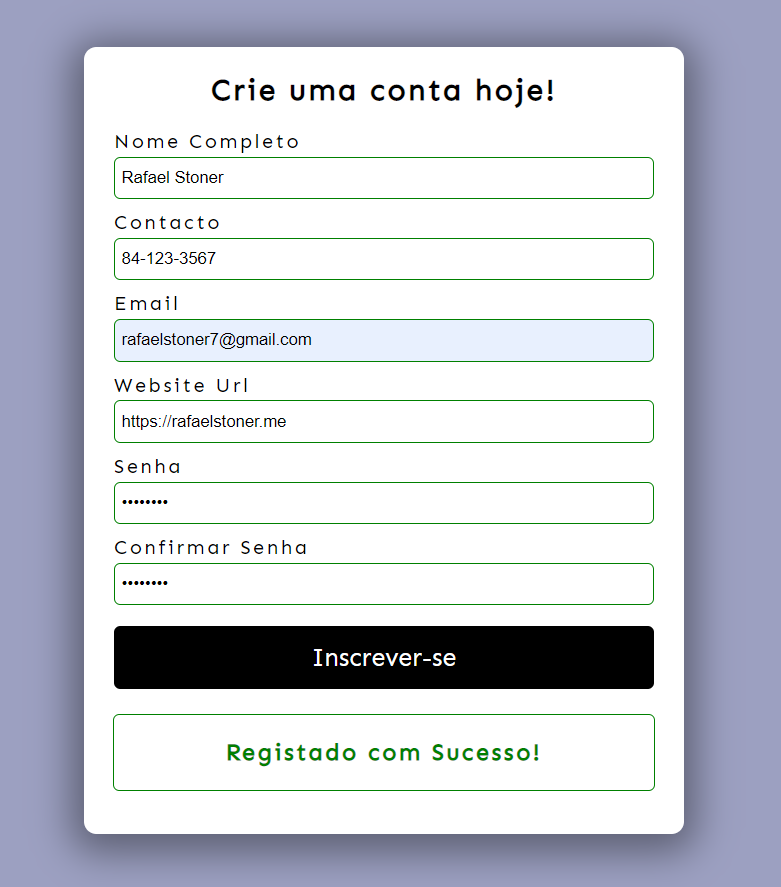

## Ver em acção
https://rafaelstoner.github.io/formulario-validado/

</img>

# Formulário Profissional
O presente reposiório contém um formulário profissional e moderno, com validações feitas do lado do usuário.

## Sobre o Formulário
O formulário é bem simples, mas aborda pontos importantes como validação de dados e formatação de mensagens de erros! 
É de se esperar que um web developer saiba criar formulário que permitam fazer uma boa validação de dados e usem o mínimo de recursos computacionais para isso.

## Tecnologias usadas
HTML  
CSS  
Javascript  

# Criador
Rafael Stoner

